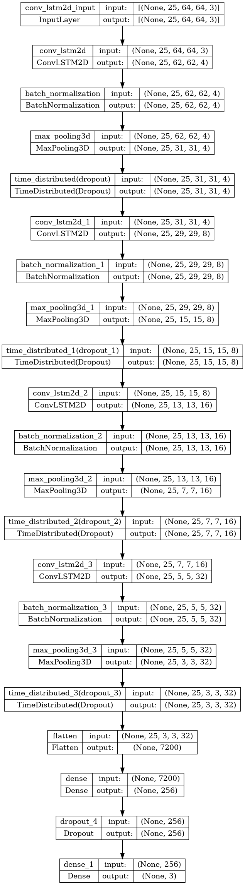

# 📌 DeepVision: Video Analysis

> A deep learning system that classifies human actions in video by jointly modeling spatial and temporal features using stacked ConvLSTM2D layers.

## 📖 Overview
 - This project implements a **4-layer stacked ConvLSTM2D model** for video action recognition on the UCF-50 dataset, classifying clips across three action categories: Basketball, Biking, and Horse Riding.
 - Unlike standard image classifiers that process frames in isolation, the ConvLSTM architecture applies convolutions directly within recurrent operations, preserving 2D spatial structure across the full temporal sequence.
 - The solution was developed and evaluated end-to-end in a **Jupyter Notebook environment**, covering frame extraction, preprocessing, model training, and evaluation.
 - The trained model is saved in Keras format for reuse without retraining.

## 🏢 Business Impact
Automated video classification reduces the cost and latency of manual video review in domains such as sports analytics, security monitoring, and activity-based content tagging. By modeling both spatial appearance and temporal motion in a single unified architecture, the system can distinguish between visually similar actions that differ primarily in how they unfold over time — a task that frame-level classifiers consistently fail at. This makes it practical for organizations that need scalable, accurate video understanding without per-frame human annotation.

## 🚀 Features
✅ **Spatio-Temporal Modeling:** Four stacked ConvLSTM2D layers jointly extract spatial features and propagate temporal context, avoiding the information loss of separate CNN + RNN pipelines.  
✅ **Automated Frame Extraction:** OpenCV pipeline samples 25 evenly-spaced frames per clip, resizes to 64×64, and normalizes pixel values — handling variable-length videos robustly.  
✅ **Regularized Architecture:** Each ConvLSTM block includes BatchNormalization, MaxPooling3D, and TimeDistributed Dropout, reducing overfitting across the temporal dimension.  
✅ **Adaptive Training:** EarlyStopping and ReduceLROnPlateau callbacks prevent over-training and automatically reduce the learning rate when validation loss plateaus.  
✅ **End-to-End ML Workflow:** Covers dataset construction, train/test splitting with stratification, model training, metric evaluation, and model persistence in a single reproducible notebook.  

## ⚙️ Tech Stack
| Technology              | Purpose                                                          |
| ----------------------- | ---------------------------------------------------------------- |
| `Python`                | Core programming language                                        |
| `TensorFlow 2.15`       | Model construction, training, and evaluation                     |
| `Keras`                 | Sequential API for building the ConvLSTM architecture            |
| `OpenCV`                | Video frame extraction, resizing, and per-frame preprocessing    |
| `NumPy`                 | Array construction, normalization, and dataset management        |
| `Matplotlib`            | Plotting training and validation metric curves                   |
| `scikit-learn`          | Stratified train/test split                                      |
| `JupyterLab`            | Interactive notebook environment for development and evaluation  |

## 📂 Project Structure
<pre>
📦 DeepVision - Video Analysis
 ┣ 📂 imgs
 ┃ ┗ 📜 convlstm_architecture.png
 ┣ 📂 models
 ┃ ┗ 📜 action_classifier_model_v1.keras
 ┣ 📂 notebooks
 ┃ ┗ 📜 deepvision_convlstm.ipynb
 ┣ 📜 LICENSE
 ┣ 📜 requirements.txt
 ┗ 📜 README.md
</pre>

> **Why a saved `.keras` model?** The trained model is persisted in Keras native format so predictions can be run on new clips without re-executing the full training pipeline, which requires the UCF-50 dataset to be present locally.

## 🛠️ Installation

1️⃣ **Clone the Repository**
<pre>
git clone https://github.com/real-ahmed-moussa/deepvis.git
cd deepvis
</pre>

2️⃣ **Create Virtual Environment & Install Dependencies**
<pre>
python -m venv venv
source venv/bin/activate
pip install -r requirements.txt
</pre>

3️⃣ **Download the UCF-50 Dataset**
<pre>
# Download UCF-50 from https://www.crcv.ucf.edu/data/UCF50.rar
# Extract and place the UCF50 folder in the project root directory
# Expected path: UCF50/Basketball/, UCF50/Biking/, UCF50/HorseRiding/
</pre>

4️⃣ **Run the Notebook**
<pre>
jupyter notebook notebooks/deepvision_convlstm.ipynb
</pre>

## 📂 Model Architecture

### ConvLSTM Network Diagram

  

## 📊 Results
 - **Task:** Multi-class action recognition on UCF-50 video clips (Basketball, Biking, Horse Riding) using a 4-layer stacked ConvLSTM2D model
 - **Classification Accuracy:** 84% on held-out test clips (25% test split, stratified)
 - **Precision / Recall:** 85% precision and 84% recall — balanced performance with no significant class skew
 - **AUC:** 97% — strong discriminative power across all three action categories
 - **Model Size:** 1.92M trainable parameters (7.32 MB), trained on CPU in 70 epochs with early stopping

## 📝 License
This project is shared for portfolio purposes only and may not be used for commercial purposes without permission.
